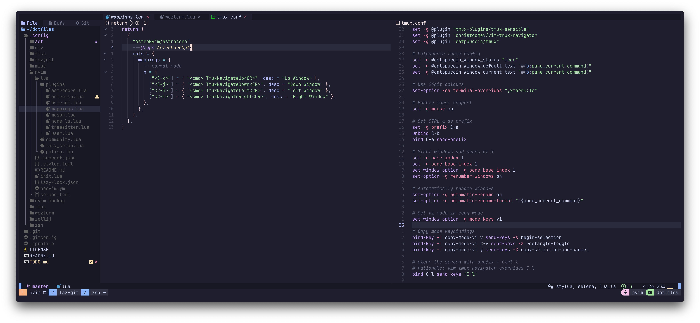

<div align="center">
  
  
  
</div>

## 🌿 Information



- **Terminal:** [wezterm](https://github.com/wez/wezterm)
- **Shell:** [zsh](https://www.zsh.org/)
- **Text Editor:** [neovim](https://github.com/neovim/neovim)
- **Neovim Config**: [astronvim](https://github.com/AstroNvim/AstroNvim)
- **Font**: [JetBrains Mono](https://www.jetbrains.com/lp/mono/)

## 📦 Installation

#### Files are structured to create symlinks using [stow](https://www.gnu.org/software/stow/)

#### Clone the repo

```sh
git clone https://github.com/levriero/dotfiles
```

#### Create symlinks

```sh
cd dotfiles && stow .
```
